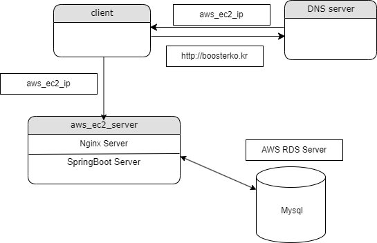

# Getting Started

### 1. Project Purpose

- User can chat with other users in real time.(Using Spring MVC and WebSocket)
- Refactoring By applying design patterns into the project.
- Using Kotlin instead of Java.
- Using JWT for authentication.
- Using SpringSecurity login and Oauth2 login(Google, Naver, Kakao).
- Using Github-Actions for CI/CD to AWS EC2.

### 2. Tables

- User

  | Column        | Type     | Description   |
  |---------------|----------|---------------|
  | id            | Long     |               |
  | name          | String   | 이름            |
  | email         | String   | 이메일           |
  | password      | String   | 비밀번호          |
  | created_at    | datetime | 생성일자          |
  | updated_at    | datetime | 수정일자          |
  | role          | String   | 권한            |
  | image_url     | String   | 프로필이미지        |
  | refresh_token | String   | Oauth 리프레쉬 토큰  |
  | social_id     | String   | Oauth 로그인 아이디 |
  | social_type   | String   | Oauth 로그인 사이트 |

### 3. Development Environment 

#### - backend
* Kotlin
* Spring Boot, Spring Security, WebSocket, Nginx
* JPA, Hibernate, flyway
* Junit5, Mockito
* Gradle

#### - devops
* Github Actions
* AWS EC2
* AWS RDS
* Docker

#### - frontend
* Javascript
* Spring MVC

### 4. Project Structure

### 5. How to deploy

- when you push the code to the main branch, the github-action will be triggered.
- you must set the environment variables in the github repository settings.
- your server(AWS) must install docker, certbot
- AWS RDS(Mysql) must be created.

### Reference Documentation And Sites

* [Github WebSocket Reference](https://github.com/dailycodebuffer/Spring-MVC-Tutorials/blob/master/spring-websocket)
* https://codepen.io/
* [JWT Reference](https://github.com/Tienisto/spring-boot-kotlin/tree/master/rest-jwt-jpa)
* [Spring Security Reference1](https://github.com/thombergs/code-examples/tree/master/spring-security/getting-started)
* [Spring Security Reference2](https://spring.io/guides/gs/securing-web)
* [Chat-GPT](https://chat.openai.com/)
* [kakao-oauth2-api](https://developers.kakao.com/docs/latest/ko/kakaologin/rest-api)
