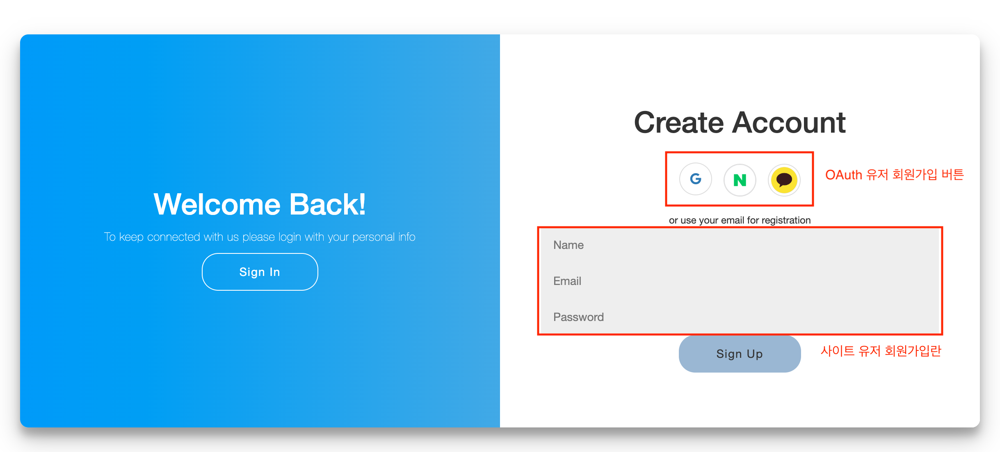
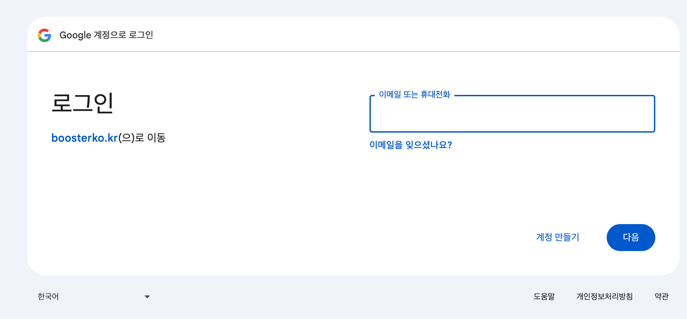
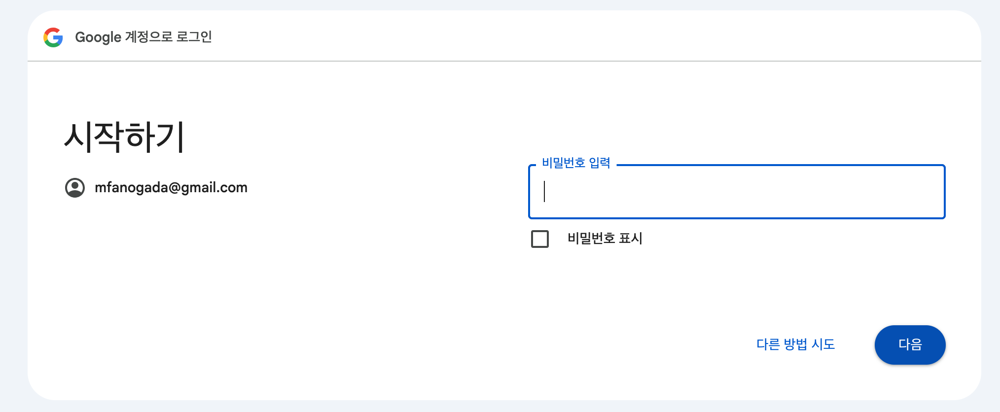
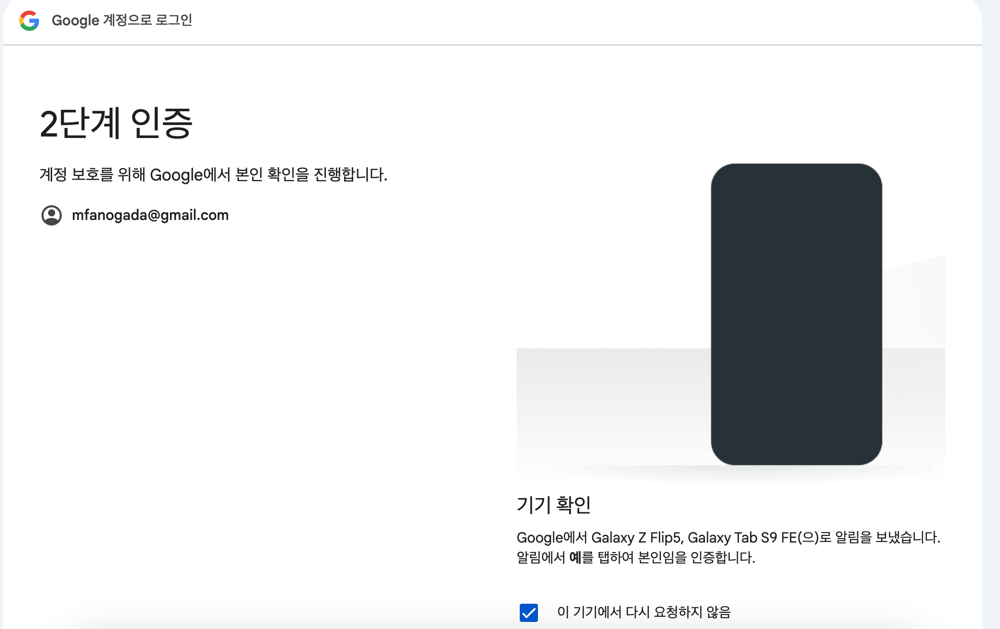
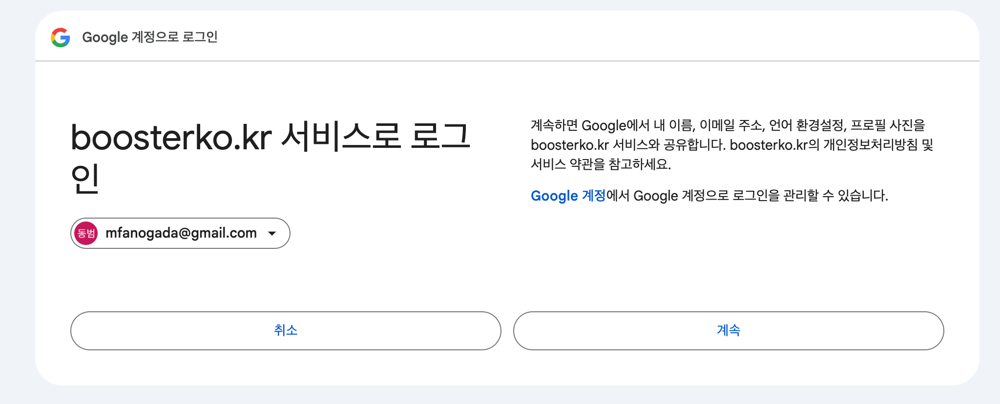
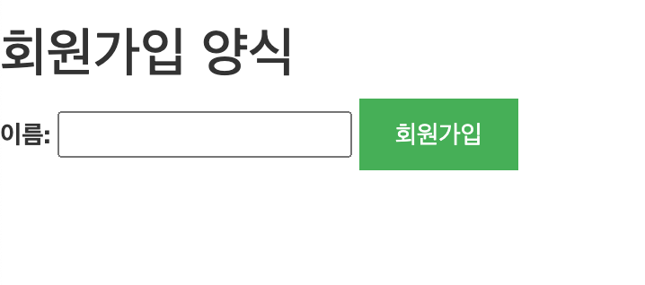
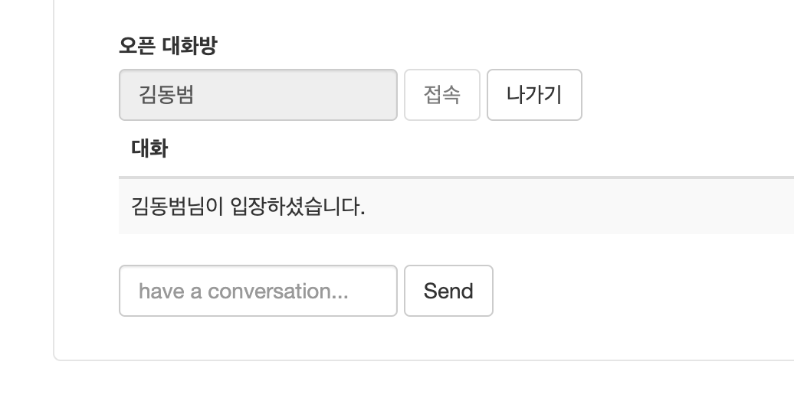
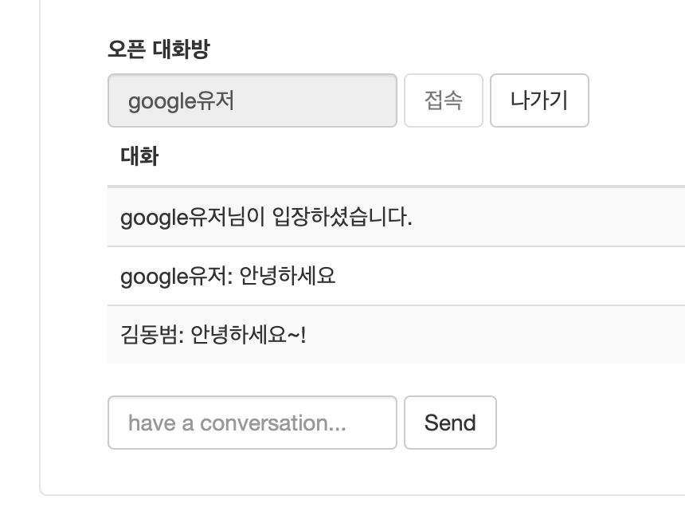
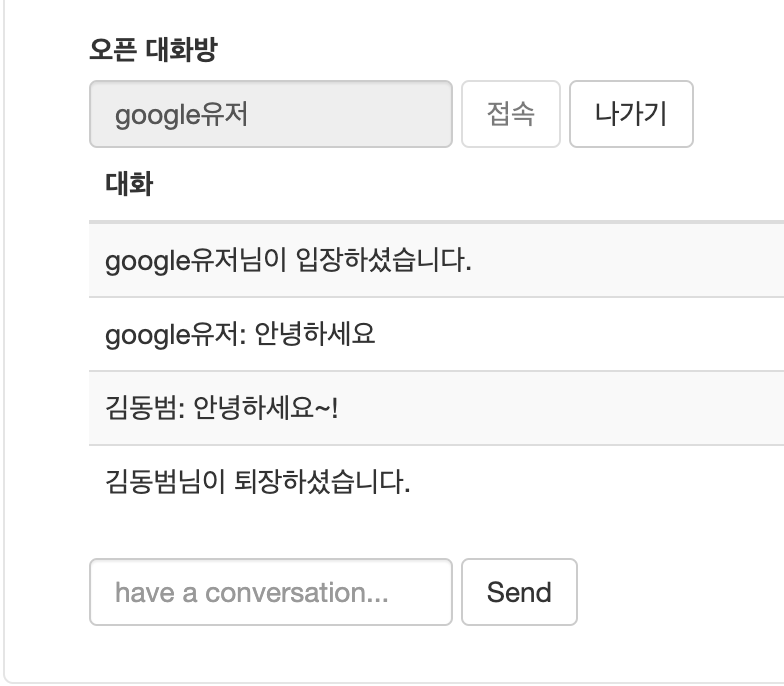

# 시작하기

### 1. 프로젝트 목적 

이 프로젝트는 개발부터 AWS Cloud에 배포까지 실시간 채팅 어플리케이션을 개발하는 것을 목표로 합니다.
주요 기능과 기술을 다음과 같습니다: 
(홈페이지: https://boosterko.kr)

- **실시간 채팅**: Spring MVC와 WebSocket을 사용하여 사용자가 실시간으로 다른 사용자와 채팅할 수 있습니다.
- **CI/CD**: Github-Actions를 사용하여 지속적인 통합과 배포를 자동화. (Main 브랜치에 코드를 Push 하면 자동으로 배포)
- **AWS Cloud**: AWS EC2, RDS를 사용하여 서버를 구축하고 배포합니다.
- **OAuth2 로그인**: Google, Naver, Kakao를 통한 OAuth2 로그인을 지원합니다.
- **Nginx**: Nginx를 사용하여 프록시 서버를 구축하고 SSL 인증서를 발급합니다. 
  

### 2. 데이터베이스

- User Table

  | Column        | Type     | Description   |
  |---------------|----------|---------------|
  | id            | Long     |               |
  | name          | String   | 이름            |
  | email         | String   | 이메일           |
  | password      | String   | 비밀번호          |
  | created_at    | datetime | 생성일자          |
  | updated_at    | datetime | 수정일자          |
  | role          | String   | 권한            |
  | image_url     | String   | 프로필이미지        |
  | refresh_token | String   | Oauth 리프레쉬 토큰  |
  | social_id     | String   | Oauth 로그인 아이디 |
  | social_type   | String   | Oauth 로그인 사이트 |
  

### 3. 개발 환경 

#### - backend
* Kotlin
* Spring Boot, Spring Security, WebSocket, Nginx
* JPA, Hibernate, flyway
* Junit5, Mockito
* Gradle

#### - devops
* Github Actions
* AWS EC2
* AWS RDS
* Docker

#### - frontend
* Javascript
  

### 4. 프로젝트 구조

  

### 5. 배포 방법 

- 코드를 main 브랜치에 푸시하면 github-action이 트리거됩니다.
- github 저장소 설정에서 환경 변수를 설정해야 합니다.
- 서버(AWS)에 docker와 certbot이 설치되어 있어야 합니다.
- AWS RDS(Mysql)이 생성되어 있어야 합니다.
  

### 6. UI 

**1. 로그인 페이지**

  

**2. 회원가입**

  

    
    
1: 이메일 입력

  

  

    
    
2: 패스워드 입력

  

  

    
    
3: 모바일 본인인증

  

  

    
    
4: 회원가입 동의 여부

  

  

    
    
5: 사이트 닉네임 입력

  

  

**3. 채팅 페이지**

  

    
    
1: 채팅방 접속

  

  

    
    
2: 다른 유저와 채팅

  

  

    
    
3: 채팅방 퇴장

  

  
### 참고 문서 및 사이트 

* [Github WebSocket Reference](https://github.com/dailycodebuffer/Spring-MVC-Tutorials/blob/master/spring-websocket)
* https://codepen.io/
* [JWT Reference](https://github.com/Tienisto/spring-boot-kotlin/tree/master/rest-jwt-jpa)
* [Spring Security Reference1](https://github.com/thombergs/code-examples/tree/master/spring-security/getting-started)
* [Spring Security Reference2](https://spring.io/guides/gs/securing-web)
* [Chat-GPT](https://chat.openai.com/)
* [kakao-oauth2-api](https://developers.kakao.com/docs/latest/ko/kakaologin/rest-api)
